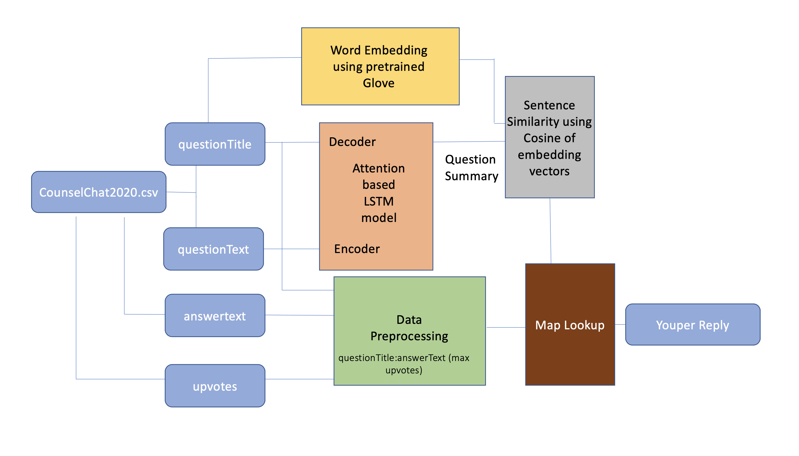

# NLPChallenge
NLPChallenge Repository

# Project objective:
This project provides the functionality to Youper to reply with context based reflection as per the journal provided by the user.  

We have used the counselChat2020.csv data to build our model and the architecture.

# Model Architecture: 
The architecture uses Attention based deep learning model, Glove word embedding and Sentence Ranking using Cosine Similarity to come up with a Youper reflection.  

We have used the below Model Architecture for our solution:   

We have considered the 'questionText' as an input to the encoder and 'questionTtile' as the target for the decoder. We have used Luong's attention model[1].  

The predicted question summary is then matched with the pretrained embeddings of the titles. The title with the highest matching score is selected and then looked up in the answers map. The answers map created a dictionary between the questionTitle and answerText based on the answer with maximum upvotes.  

The model configuration are given in Network.py. Data engineering and Sentence Ranking is performed in DataPreprocessing.py. We build the model using Summarizer.py and Application.py tests the performance of the model on user input. 

# Building and Evaluating the model:
We have used 256 sized hidden LSTM layer without any stacking. For training we have used 90-10 split in the data (as the size of dataset is comparatively smaller). The training also used teacher forcing method to make the training faster in case of seq-to-seq model. We have linear regularisation to prevent overfitting.  

Glove 100d pretrained embeddings are used to build the word embedding for the question tiles and cosine similarity is used for sentence ranking.   

The final model along with the states of the layers are stored in model.pt. For building the model run Summarizer.py and for evaluating the model run Application.py.  

Note: The model is currently trained on GoogleColab using GPU support. If your machine doesn't have GPU support please change the device parameter in Network.py to CPU and retrain the model. 

The model is evaluated with actual user input enter through a prompt. We can check the bots reply as per our journaling input. 

# Conclution and Future Scope:
This project provides a brief overview and model for the approach taken to solve the challenge. Below are some of the improvements we would like to consider:  
1. The model currently is trained based on the data provided in our dataset. A more denser dataset would be able to provide promising results from attention model. The current dataset has single input mapped to multiple outputs which is not the best mapping for a deep learning model. Hence we have considered question and question title which has better mapping. 
2. A self built embedding can at times provides better result as we can build custom models. 
3. We would also like to try the extent of stacked LSTM and other architectures to evaluate the performance of the model. 
4. Create an API integrated with Application.py or build a Core ML model to integrated with an Mobile app easily. 
5. Reduce the dependency between Application.py and Summarizer.py. 
6. Added functionality to build multi-decoder architecutre to support counselling in other languages as well. 

# Bibliography and Reference: 
1. Effective Approaches to Attention-based Neural Machine Translation (Luong et. al, 2015)
2. https://blog.floydhub.com/attention-mechanism/
3. https://github.com/anurag93/NLP/tree/master/TextSummarisation

